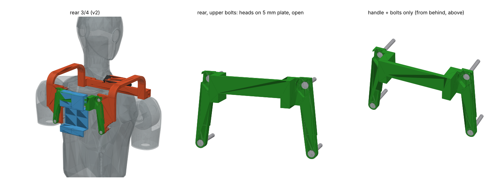
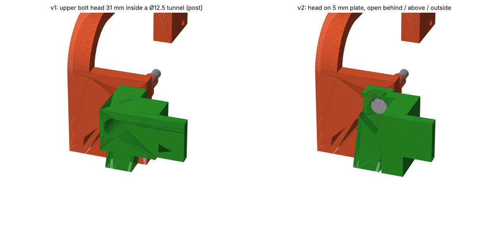

# H2 등판 손잡이 (미니 PC 걸이)

카메라 거치대 요크 받침판 뒤에 겹쳐 **등판 M6 4개로 같이 조이는** 부품 1개 (FDM PLA).
걸이판(핀) 윗변에 사용자 걸이 판(back.stl, 수정 없이 사용)의 고리를 걸어 미니 PC 를 등에 단다.

  초록 = 손잡이, 파랑 = back.stl 걸린 모습

## v2 (2026-10-09) — 위 볼트를 손으로 돌릴 수 있게

v1 은 위 볼트 머리가 받침대 속 Ø12.5 구멍 **31 mm 안쪽**이라 손(L 렌치 짧은 쪽)이 안 들어감.
v2 는 위 볼트 둘레를 뒤에서 R 12 로 파서 머리가 **5 mm 판 위에 바로 드러남** (아래 볼트처럼) — 뒤·위·바깥이 트임.

| | v1 | **v2** |
| --- | --- | --- |
| 위 볼트 머리 | 받침대 속 Ø12.5 × 31 mm 구멍 바닥 | **R 12 로 판 자리, 뒤·위·바깥 트임** (머리 뒤 R 10 × 35 mm 빈 공간 확인) |
| 받침대 (핀 ↔ 띠) | \|y\| 48–84 (위 볼트를 덮음) | **\|y\| 48–62** (위 볼트 안쪽) + 띠를 안쪽으로 넓힌 판(앞면 x −94, 두께 8) |
| 핀 폭 | y ±66 | **y ±62** (받침대 바깥 끝까지) |
| 볼트 | 위 M6×50, 아래 M6×50 | 같음 (위 박힘 10.55 그대로) |



## 출력

| 파일 | 크기 | 방향 | 서포트 |
| --- | --- | --- | --- |
| `print/handle_print.stl` (`.step`) | 36 × 192 × 높이 119 mm | 파일 그대로 = **윗면(로봇 z 400)이 바닥** (뒤집어 출력) | 필요 없음 — 위 볼트 자리 파기는 출력 때 위로 뾰족한 눈물방울 |

PLA, 벽 4줄, 채움 40 % 이상, 브림 권장 (띠가 119 mm 높이로 섬).
`../h2_print_all.step` 에 거치대 3부품과 같이 들어 있음 (v2 로 갱신).

## 볼트 (M6 접시머리 4개, 와셔 없음)

| 위치 | 볼트 | 머리 위치 | 나사 박힘 |
| --- | --- | --- | --- |
| 등판 위 구멍 2 | **M6×50** (지금 것 그대로) | x −95 판 면 (뒤·위·바깥 트임 — 손·L 렌치 바로) | 10.55 mm (도면 깊이 18) |
| 등판 아래 구멍 2 | **M6×50** (지금 M6×40 → 교체) | 손잡이 뒷면 x −102 | 11.55 mm (도면 깊이 13) |

## 조립

1. 등판 볼트 4개를 한쪽씩 풀어 손잡이를 요크 받침판 뒤에 대고 다시 조인다 (요크가 빠지지 않게 한 번에 한 구멍씩).
   - 위 구멍: 띠 앞면이 받침판(x −90)에 닿음. 볼트는 판 자리에 바로 넣고 손으로 돌려 시작 → L 렌치로 마무리.
   - 아래 구멍: 띠 앞면이 요크 3 mm 돋움(x −93)에 닿음. M6×40 → M6×50.
2. PLA 라 손으로 꽉 (약 1–1.5 N·m), 나사 고정제(중강도) 권장. 위 볼트 머리 밑 판은 5 mm 라 너무 세게 조이지 말 것.
3. back.stl 고리를 핀 윗변에 위에서 걸어 내림 (고리 입구 7 mm, 핀 6 mm, 천장이 핀 윗변에 얹힘).
   고리 열린 쪽(입술)이 로봇 쪽, 밑판(미니 PC 쪽)이 바깥.

## 치수·검증 (오프라인, 2026-10-09, v2)

- 핀 x −126..−120 (두께 6), z 374..400 (높이 26), y ±62. 받침대 x −126..−102, |y| 48–62, z 360–400 (back.stl 폭 87 과 좌우 4.5 mm).
- 몸통 틈: 손잡이 5.1 mm (안쪽 넓힌 판 — 등 가운데 위쪽이 x −88 까지 나옴, v1 12.6), 걸린 back.stl 9.1 mm.
- 머리 전 범위 61.3 mm, 잡기 시퀀스 팔 9.3 mm (v1 7.5), 요크·볼트·걸린 판과 겹침 없음, 한 덩어리(solid 1).
- 팔 격자(잡기 밖 동작) 5 mm 미만: 손잡이 83 / 2592 자세 (v1 89), 걸린 판 13–19 (점 표본에 따라) — 팔을 등 뒤로 크게 젖히는 자세.

## 확인 필요

- 미니 PC 무게·크기 — 넓으면 팔을 등 뒤로 젖힐 때 닿을 수 있음. 로봇 들어 올리는 손잡이로 쓰지 말 것 (PLA + 공유 볼트).
- 등판 나사 깊이 (아래 ≥ 12.5 mm 들어가야 M6×50 사용 가능) — 카메라 거치대 README 1번 절차와 같음.
- 몸통 틈 5.1 mm 는 STEP 단순화 모델 기준 (오차 95 % 5.2 mm) — 끼우기 전에 안쪽 넓힌 판과 등 사이를 눈으로 확인.

## 다시 만들기

```bash
python handle.py out [back.stl]   # back.stl 을 주면 걸린 모습 STL 도 만듦
cp out/handle_print.* print/ && cp out/handle_torso_frame.stl robot_frame/
cd .. && python print_all.py      # h2_print_all.step 갱신
```
