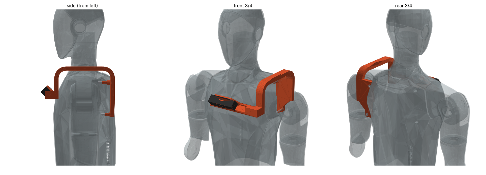
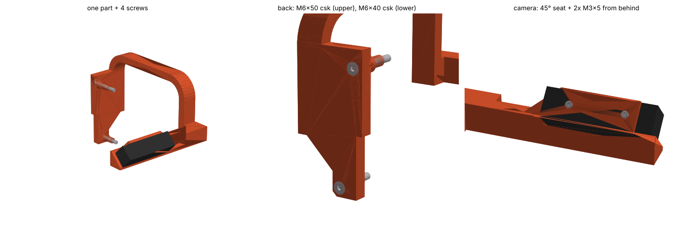
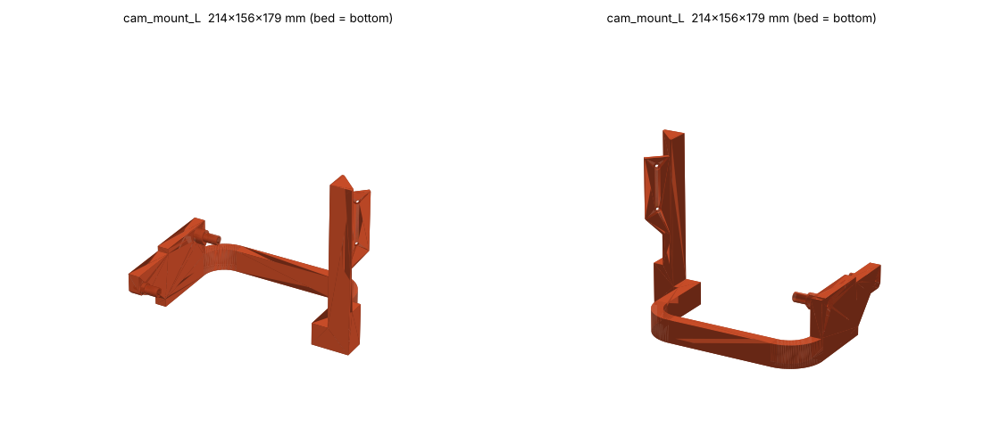
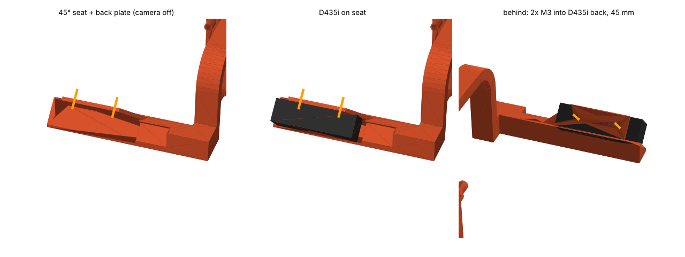

# H2 D435i 카메라 거치대 (한 부품, FDM PLA)

왼쪽 등판 M6 구멍 2개에 고정 → 왼쪽 어깨 위로 넘어와 → 가슴 앞 가운데에 D435i 를 **아래로 45°** 로 둔다.
**부품 1개 + 볼트 4개** (M6 2 · M3 2). 오른쪽은 비어 있음.

**한 파일로 보기: `h2_cam_bracket_all.step`** — 부품 + D435i 더미 + 볼트 4개를 조립 위치 그대로 (로봇 torso_link 좌표, mm, 나사산 생략).




## 출력

| 파일 (`print/`) | 출력 크기 | 출력 방향 | 서포트 |
| --- | --- | --- | --- |
| `cam_mount_L_print.stl` (`.step`) | 214 × 156 × 높이 179 mm | 바깥면이 바닥 (파일 그대로) → 가로대가 위로 섬 | 등 아래 혀 끝 12 × 16 mm 한 곳만 (바닥에서만 자동 서포트). 스피곳 끝 평면은 2 mm 브리지 |



권장: PLA, 노즐 0.4, 층 0.2 mm, 벽 4줄, 위/아래 5층, 채움 40 % gyroid, **브림**.
가로대가 155 mm 높이로 서는 방향이라 외벽 속도는 낮게 (≤ 60 mm/s).
등 받침판 옆 45° 경사 채움은 팔이 지나가는 자리(잡기 시퀀스)를 4 mm 남기고 채운 것 — 그 아래 빈 곳은 채우면 팔이 닿음.

## 볼트 (4개)

| 품목 | 수량 | 위치 | 나사 박힘 |
| --- | --- | --- | --- |
| **M6×50** 접시머리 | 1 | 왼쪽 등판 위 구멍 (y 75, z 389) | 12.5 mm (도면 나사 깊이 18) |
| **M6×40** 접시머리 | 1 | 왼쪽 등판 아래 구멍 (y 88, z 289) | 10.5 mm (도면 13) |
| **M3×5** | 2 | 카메라 뒷면 (뒤판 머리 자리 Ø6.5 깊이 2 → 머리 밑 판 2 mm) | 3 mm (지금 가슴 거치대와 같음) |

M6 은 와셔 없이 받침판 뒷면 90° 접시 자리 (윗지름 11.6, 머리 Ø11.1 → 머리 윗면이 0.25 mm 들어감). 너트 없음.

## 연결 구조

- **로봇 ↔ 거치대**: 왼쪽 등판 M6 위·아래 2개 (100 mm 간격 → 앞뒤 숙임 고정). 스피곳 2개가 우물에 들어가 바닥(나사 시작면)에 닿게 조임.
- **거치대 ↔ 카메라**: 가로대 끝 45° 자리에 얹고 뒤판에서 M3×5 2개 (간격 45 mm — 지금 쓰는 가슴 거치대 실측과 같음).



- **USB-C**: 카메라 끝면(|y| 45) 가운데 포트. 오른쪽(−y)은 가로대가 −50 에서 끝나 열려 있음, 왼쪽(+y)은 가로대를 y 44–84 파서 직선 플러그 38 mm + 위로 꺾이는 케이블 공간 (포트 위치 확인 필요라 양쪽 다).
  케이블은 가로대 → 앞 다리 → 어깨 위 띠를 따라 케이블타이로. ⚠️ 목 앞(|y| < 105, z 0.41 이상) 으로 띄우면 머리 이동 범위에 걸림. 케이블을 당겨 거치대에 힘이 가지 않게 여유를 둘 것.

### 이전 3부품 판과 차이

| | 이전 (커밋 0cdebe0) | 지금 |
| --- | --- | --- |
| 출력 부품 | 요크 좌/우 + 가로대 = 3 | **1** |
| 볼트·너트 | M6 8 + 너트 4 + M3 2 = 14 | **M6 2 + M3 2 = 4** |
| 등판 구멍 | 4개 | 왼쪽 2개 |
| 띠 두께 | 9 mm × 양쪽 | 12 mm × 한쪽 (앞뒤 숙임 굽힘 강성 1.2 배 = 24·12³ / (2·24·9³)) |
| 오른쪽 어깨·팔 주변 | 요크 있음 | 비어 있음 |

한쪽 지지라 생기는 것: 카메라가 좌우로 약간 기울 수 있음 (빔 근사로 정지 상태 약 0.1°, 카메라 무게 약 72 g 가정 — 확인 필요).
`robot.yaml camera` 는 롤을 쓰지 않으므로 이 정도는 영향 작음. 걸을 때 흔들림이 크면 이전 3부품 판(git 0cdebe0)으로.

## 조립 순서

1. **로봇 쪽 확인 (조이기 전)** — 구멍은 등 커버의 **지름 10 mm 우물** 바닥에 있습니다.
   - 우물 지름 10 mm, 깊이(테두리→바닥) 위 약 13.9 / 아래 약 12.4 mm 인지 버니어로 확인 (STEP 값, 실물 확인 필요).
     스피곳이 바닥에 닿지 않으면 볼트가 커버 테두리를 누르게 되니 확인 후 조립.
   - M6 볼트만 손으로 끝까지 돌려 나사 깊이 확인: 위 ≥ 13.5 mm, 아래 ≥ 11.5 mm 들어가야 위 볼트 길이 그대로 사용 가능.
2. 카메라 → 거치대: 45° 자리에 얹고 뒤판에서 M3×5 2개.
3. 거치대 → 로봇: 스피곳을 우물에 끝까지 넣고 위 M6×50, 아래 M6×40. **PLA 라 손으로 꽉(약 1–1.5 N·m)**, 나사 고정제(중강도) 권장.
4. 틈 확인: 등판–받침판 3 mm 이상, 어깨 위 15 mm 이상, 가슴–가로대 5 mm 이상.
5. 카메라 보정 후 `robot.yaml camera` 갱신 — 설계값 **x 0.130, y 0.000, z 0.350, pitch_deg 45.0** (torso_link 기준, 렌즈 앞면 중심).
   실측: `utils/check_rsimu.py --sec 5` (몸통 기준 숙임) → `utils/cam_marker_check.py --points 0.35,0.45` (x). 703 서기 기준 렌즈 바닥 높이 약 1.48 m.

## 검증 (오프라인, 2026-10-08)

로봇 형상: Unitree 공식 STEP `H2_简化模型_260601` 을 URDF `torso_link` 메시에 정합 (중앙 오차 1.2 mm, 95 % 5.2 mm). 팔은 공식 URDF + 이 repo 잡기 시퀀스 IK 자세.

| 검사 | 최소 거리 |
| --- | --- |
| 정지 — 몸통 (스피곳 제외) | 거치대 3.1 mm, 카메라 15.9 mm |
| 정지 — 어깨·상완·목·머리 | 18.2 mm 이상 |
| **머리 전 범위** (숙임 −30..+48°, 좌우 ±100°) | 거치대 23.5 mm, 카메라 29.8 mm |
| **잡기 시퀀스 팔** (place/center, 박스 x 0.35–0.50 · y ±0.05, 3577 자세, 양팔) | 거치대 6.0 mm (이전 5.9), 카메라 30 mm 이상 |
| 왼팔 격자 (어깨 pitch −90..69 · roll 전 범위 · 팔꿈치 전 범위) | 팔을 몸 앞쪽으로 모으는 자세(손이 가슴·카메라 쪽)는 닿음 (5 mm 미만 477 / 2592 자세, 이전 507) — 잡기 시퀀스 밖 동작은 주의 |
| 볼트 모델 ↔ 부품 | 겹침 없음 (M3 끝 3 mm 가 카메라에 박히는 것만) |

카메라 시야 (박스 윗면 바닥 1.26 m, 숙임 45°): 박스 윗면 앞뒤 20 cm 면 박스 중심 x 약 0.33–0.55 m, 30 cm 면 0.38–0.50 m.

## 확인 필요

- 우물 지름·깊이, 나사 깊이, 나사 쪽 재질(인서트 여부) — STEP 은 단순화 모델. 1번 절차로 확인 후 조립.
- D435i 외형 90×25×25 mm, 무게, 뒷면 M3 높이(뒷면 가운데로 가정), USB-C 포트 쪽 — 지금 거치대와 맞대 보고 확인.
- 실물 등 커버가 STEP 과 몇 mm 다를 수 있음 — 받침판–등판 틈 3 mm 가 가장 작음. 닿으면 `bracket.py` 의 `PX0`·`PX1`(받침판 뒷면/앞면 x) 을 같이 뒤로.

## 다시 만들기

```bash
pip install cadquery          # 2.8 확인
python bracket.py out         # out/ 에 cam_mount_L_print.stl / .step, *_torso_frame.stl, h2_cam_bracket_all.step
```
치수는 `bracket.py` 위쪽 상수. 카메라 위치·각도를 바꾸면 머리·팔 간섭과 시야를 다시 확인해야 함.
